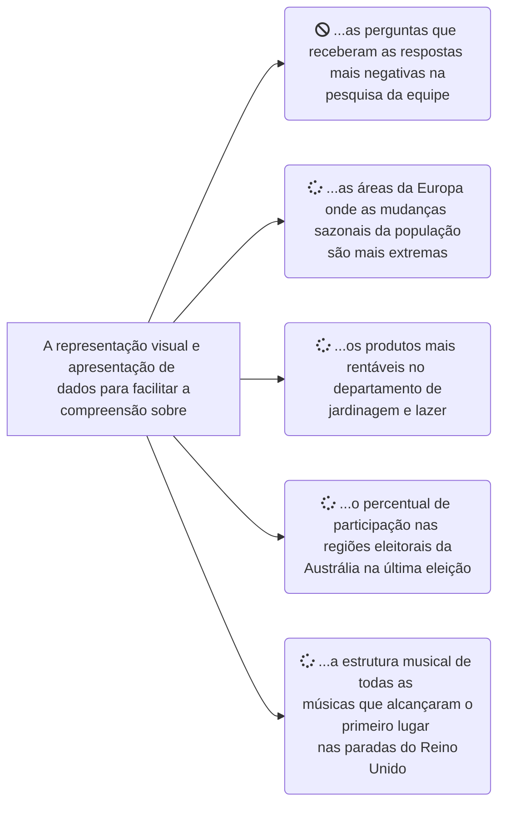

## Formulando Seu Brief

No Capítulo 2, aprendemos sobre a importância de adotar um processo para enfrentar os desafios da visualização de dados por meio de uma sequência organizada de atividades. Complementado pelo benefício orientador dos princípios de design, isso oferece uma estrutura para ajudá-lo a tomar boas decisões. Este terceiro capítulo inicia o processo de design a partir do estágio 1. Este estágio engloba atividades relacionadas com a “formulação de seu briefing” para criar clareza inicial sobre o contexto e a visão de seu trabalho.

A manifestação de um briefing pode ser tão informal ou tão formal quanto sua situação exigir. Por exemplo, pode ser útil ao trabalhar com outras partes interessadas documentar informações sobre os requisitos e condições de um projeto. Ele pode então ser compartilhado, acordado e encaminhado de volta. Será do interesse de todas as partes ter essa fonte de entendimento mútuo, especialmente para assuntos relacionados com os resultados esperados. Para projetos mais pessoais, talvez seja necessário fazer anotações básicas para capturar seus pensamentos.

A principal tarefa desta etapa é estabelecer por que você está produzindo essa visualização de dados. Qual é a sua razão de ser? Isso envolve identificar a curiosidade de origem que conduzirá seu trabalho. Esta é uma articulação do apetite por entender que você está abordando através de sua visualização. Nenhum projeto de visualização é realizado sem restrições, então você também gastará tempo definindo as questões contextuais influentes em torno de quem, onde e quando. Esses requisitos e fatores moldarão as condições do projeto que você está prestes a realizar e precisam ser reconhecidos antecipadamente.

Você então mudará o foco, olhando para frente para considerar a visão do seu trabalho. Pensar nessa visão representa o pensamento conceitual inicial sobre o que você pode estar desenvolvendo, fornecendo pistas iniciais sobre o tom mais adequado, a experiência funcional e o estilo que sua visualização pode precisar demonstrar. As especificidades centradas no design de como você cumprirá isso serão mantidas em espera até chegarmos ao estágio 4 mais tarde no processo.

Ao definir o propósito do seu projeto, você considerará mais profundamente para que serve: o que você está tentando realizar? O tipo de compreensão que você está facilitando é importante. Por exemplo, você está transmitindo mensagens importantes ao seu público ou permitindo que eles façam suas próprias descobertas? Você está colocando ênfase na precisão da legibilidade ou amplificando a sensação de um assunto? Também veremos como aproveitar as ideias instintivas que se formam em nossas mentes, relacionadas às palavras-chave, imagens, metáforas e inspiração externa que possam ser relevantes para o assunto.

## 3.1 Definindo o contexto do seu projeto
### Qual é a curiosidade motivadora?

Responder à pergunta "Onde começa um processo de visualização de dados?" pode parecer simples. Instintivamente, pode-se sugerir que comece com um pedido. Alguém pede a outra pessoa para fazer uma visualização. Eles compartilham algumas informações básicas sobre os requisitos, talvez forneçam acesso a alguns dados, e isso coloca o processo em movimento.

Este tipo de cenário é claramente comum. No entanto, embora possa ser assim que um processo começa, não é bem representativo de onde as coisas realmente começam. Você vê, antes de um pedido ser emitido, antes de qualquer dado ser compartilhado e certamente antes de qualquer trabalho de design ser iniciado, uma curiosidade se formou: algum interesse de origem mantido por alguém sobre um assunto. ou para aprender alguma coisa'. Se a visualização é para facilitar a compreensão, essas são as duas extremidades que se encontram. A curiosidade representa, portanto, o porquê do seu processo: o motivo instigante e impulsionador para o desenvolvimento de um projeto de visualização. Você não cria uma visualização porque tem dados. Você cria uma visualização porque existe um apetite definível pelo entendimento que ela oferece, seja esse apetite mantido por você ou por outra pessoa (que você essencialmente herda). Qualquer trabalho de visualização realizado na ausência de uma curiosidade definível levará a um processo de tomada de decisão incerto e sem objetivo.

Ao identificar a curiosidade de origem do seu projeto, dá forma às suas decisões subsequentes, especialmente aquelas relacionadas ao lado do conteúdo do seu trabalho. Isso permite que você continue verificando se suas escolhas ajudam a contribuir para facilitar o entendimento sobre os assuntos mais relevantes.

Um atributo-chave de qualquer curiosidade é reconhecer de quem ela se origina. A Figura 3.1 mostra um exemplo de visualização produzida em resposta à minha própria curiosidade reconhecida. Este tipo de trabalho é muitas vezes caracterizado como sendo um projeto de 'animal de estimação' ou 'paixão' que é totalmente auto-iniciado, sem nenhuma outra parte interessada envolvida. Você tem liberdade para seguir sua própria pesquisa, moldada apenas pelas limitações de sua imaginação e interesses. O projeto 'Filmografia' foi inteiramente motivado por uma curiosidade que eu tinha sobre a indústria cinematográfica: 'Quais são os padrões de sucesso ou fracasso nas carreiras cinematográficas de uma série de atores/diretores notáveis?'

> 'Ser curioso. Todo mundo se diz curioso, ninguém quer dizer “não, eu sou completamente ‘descurioso’, não quero saber do mundo”. O que quero dizer é que, se você quer trabalhar com visualização de dados, precisa ser implacável e sistematicamente curioso. Você deve tentar se interessar por tudo e qualquer coisa que apareça no seu caminho. Além disso, você precisa entender que a curiosidade não é apenas sobre seus interesses serem acionados. A curiosidade também envolve perseguir esses interesses como um cão de caça. Ser verdadeiramente curioso envolve muito trabalho duro, dedicando tempo e esforço para aprender o máximo possível sobre vários tópicos e fazer conexões entre eles. A curiosidade não é algo que vem naturalmente. Pode ser ensinado e pode ser aprendido.” Professor Alberto Cairo, Knight Chair em Jornalismo Visual na Universidade de Miami, e Especialista em Visualização

_Figura 3.1 Filmografia, por Andy Kirk e Matt Knott_

Articular minha curiosidade dessa maneira ajudou a focar minhas decisões sobre quais dados coletar, quais análises conduzir e, posteriormente, quais recursos de representação e apresentação empregar. Havia muitas coisas que eu poderia ter explorado sobre a indústria cinematográfica, mas essa foi a fatia específica de conteúdo que mais me intrigou. Eu queria saber sobre a história da carreira de Steven Spielberg. Eu queria saber se os sucessos críticos de Meryl Streep foram acompanhados pelo sucesso financeiro. Quando foi a última vez que De Niro fez bons filmes? Por que Adam Sandler foi autorizado a fazer algum?

Embora o projeto Filmografia tenha sido iniciado por mim e servido ao meu apetite de compreensão, foi publicado abertamente na expectativa de que também fosse relevante para alguns outros públicos que talvez compartilhem um interesse no assunto. Eu não estava atendendo explicitamente à curiosidade deles, mas esperando que alguns compartilhassem da minha curiosidade.

Às vezes, a curiosidade que você está perseguindo não se origina de você. As partes interessadas são as pessoas envolvidas em um projeto de visualização, além de você, que podem influenciar a curiosidade que seu trabalho deve buscar. As partes interessadas existem como gerentes, supervisores acadêmicos, clientes ou colegas, e podem ser eles que o encarregam de realizar um projeto de visualização com base na curiosidade que expressam a você. Nessas situações, você está herdando o interesse deles e tem que possuí-lo a partir de então.

Em certas situações, as partes interessadas podem ter um papel duplo de iniciador e destinatário pretendido (por exemplo, 'você pode me mostrar as tendências de ausência por doença entre os funcionários do meu departamento este ano?'), em outras, eles podem estar expressando a você o que esperam de um público acharia interessante (por exemplo, 'você pode produzir uma análise mostrando as tendências de faltas por doença entre os funcionários este ano para compartilhar com todos os chefes de departamentos?').

Um ponto importante do capítulo anterior precisa ser reforçado aqui: esta é a primeira, mas não a última ocasião em que você terá a oportunidade e a razão de refinar a definição de sua curiosidade final. Dependendo da situação particular do seu trabalho, pode ser que sua curiosidade inicialmente expressa não seja fixa, nem específica e nem mesmo singular.

A necessidade de especificidade em sua curiosidade varia de uma situação para outra. "Quanto o público se envolveu com a eleição australiana anterior?" é uma curiosidade muito mais ampla do que "Qual foi a porcentagem de participação em cada região eleitoral da Austrália em comparação com a eleição anterior?" Se você é um corredor com um dispositivo de rastreamento de condicionamento físico ou aplicativo, você pode terminar uma corrida e se perguntar “quão boa foi essa corrida?” Essa é uma pesquisa ampla. Formar uma resposta requer a síntese de várias informações distintas (‘Até onde? Que horas? Que rota? Que conquistas? Que tempos anteriores?’) que coletivamente fornecem uma noção de quão boa foi a corrida. Por outro lado, se você só quer saber 'em que horas eu completei a corrida?', essa é uma curiosidade específica que pode ser respondida de forma eficaz por uma única informação.

Em muitas ocasiões, embarquei em um projeto de visualização com uma curiosidade inicial em mente, mas, depois de conhecer melhor o assunto por meio de seus dados, outras perguntas legítimas surgiram posteriormente mais relevantes. É mais fácil justificar a mudança de foco ao trabalhar em seus próprios projetos. Quando você está sendo encarregado por outra parte interessada, você pode descobrir que há menos espaço para manobra além da busca para a qual você foi encarregado. Dito isso, você ainda deve buscar um diálogo constante com sua parte interessada se achar que outra rota pode ser mais interessante. Afinal, não serve a ninguém se você permanecer ancorado em uma indagação que não reflete mais os aspectos mais relevantes de um assunto. O importante a questionar é se qualquer mudança de foco deve ser adotada ou reduzida. Não importa quão relevantes ou interessantes sejam suas novas possibilidades, você pode simplesmente estar se afastando do escopo do trabalho.

Às vezes, seu processo está sendo impulsionado pela necessidade de atender aos interesses conhecidos ou previstos de seu público-alvo. Se você conhece seu público bem o suficiente e é capaz de prever suas necessidades potenciais, sua curiosidade de origem se formará em torno do que você acha que eles querem responder. Claro, haverá situações em que você estará em posição de consultar seu público diretamente para definir explicitamente o apetite que eles têm sobre o tópico em questão. Caso contrário, você precisará fazer julgamentos razoáveis ​​para antecipar o que a maioria das pessoas provavelmente achará mais interessante. Estas são as situações em que encontro mais indecisão em um processo de visualização, principalmente porque há sempre tanta escolha e tanta tentação de marcar tudo como sendo de igual interesse. Além disso, no início de um projeto, pode não ser razoável esperar que você esteja ciente de todos os recursos potenciais de interesse sobre o seu assunto ou em seus dados. 

Isso é algo que se desenvolverá à medida que você avança no estágio 2 (‘Trabalhando com dados’) e no estágio 3 (‘Pensamento editorial’).

Muitas vezes, comprometer-se com apenas uma única via de curiosidade não é viável. Embarcar em várias curiosidades distintas, vinculadas por uma conexão compartilhada com o mesmo assunto, pode dar mais trabalho, mas pode ser necessário, especialmente com dados ou assuntos que você não conhece no início.

Suponha que você seja um estudante de história da música e encontre alguns dados sobre a estrutura das canções populares. Você suspeita que há muitas coisas potencialmente fascinantes para descobrir nesses dados, mas ainda não sabe qual será a curiosidade mais interessante. Uma atividade-chave do processo de visualização será explorar os dados, desvendar suas principais qualidades, testar as várias consultas diferentes e, posteriormente, determinar quais perspectivas oferecem as descobertas mais relevantes ou interessantes. Você possivelmente está perseguindo várias curiosidades especulativas para ver quais surgem como mais relevantes. Você ainda pode acabar com várias, apenas uma, ou mesmo nenhuma curiosidade legítima.

Na minha experiência, formar uma pergunta tende a ser a articulação mais útil e confortável de uma curiosidade. Ao fazer isso, você está posicionando sua visualização como um meio de fornecer alguma noção de resposta. Acho isso uma maneira natural de manter minha mente focada em buscar essa resposta.

Uma maneira alternativa de abordar isso, especialmente quando você está antecipando o que os outros podem achar interessante, é mudar seu ponto de vista da forma de pergunta e pensar mais em termos do que você pretende apresentar ao seu público. Você pode estender o texto da definição de visualização de dados para descrever sobre o que será o entendimento facilitado, conforme ilustrado na Figura 3.2.

_Figura 3.2 Exemplos de Declarações de Curiosidade_

Independentemente da origem, especificidade, permanência e forma da sua curiosidade, você só precisa de um lugar para começar. Procure expressar a curiosidade dominante mais útil que melhor encapsula, neste estágio, o que você está planejando buscar para você e/ou seu público. Defina agora, refine depois.

### Identificando as Circunstâncias do Projeto

O segundo aspecto do pensamento contextual diz respeito à identificação das circunstâncias de um projeto. Estas são as fricções e liberdades que são impostas a você ou determinadas por você. Seja você um profissional de visualização em tempo integral, um estudante, um pesquisador, trabalhando em um negócio ou fazendo visualização como um passatempo, existem fatores de influência comuns que caracterizam as condições dos projetos que você está realizando. Eles determinarão os limites de suas ambições criativas.

Ao iniciar um projeto, provavelmente nem todas as circunstâncias que podem influenciar seu trabalho serão definíveis. As coisas mudam. É por isso que precisamos estar preparados para acomodar com elegância o impacto de novos fatores em qualquer ponto do processo. Claro, quanto mais coisas você pode definir, mais coisas se tornam fixas e isso reduz as incertezas. Idealmente, queremos eliminar o máximo possível do desconhecido. A definição útil também existe através da identificação da ausência de restrição ou exigência. Saber que você tem liberdade para determinar as escolhas por si mesmo é de claro valor. Dá-lhe o controle. Às vezes, você pode ver mérito em impor restrições a si mesmo, onde não existem, para ajudar seu foco. As restrições nem sempre são ruins; na verdade, eles muitas vezes podem nos ajudar a inovar.

### Pessoas

**Stakeholders**: Em situações de projeto em que você foi solicitado a desenvolver uma visualização por outra pessoa, é importante estabelecer uma compreensão de quem está envolvido. "Quem é o cliente final?" é uma pergunta-chave a ser respondida. O cliente sempre estará particularmente interessado no que você desenvolve. Esta pode ou não ser a(s) pessoa(s) que o comissionou diretamente, mas eles geralmente determinarão se o trabalho está no caminho certo, na opinião deles. Eles também determinarão criticamente quando o trabalho é, em última análise, de qualidade suficiente para ser considerado concluído. No meu mundo como consultor de design freelancer, meu cliente determina quando (e se) serei pago.

Outras partes interessadas podem existir como especialistas no assunto, disponíveis para oferecer conselhos sobre consultas específicas de domínio. Eles podem orientá-lo sobre quais são as questões mais salientes em um assunto. Eles podem ser pontos de contato para levantar questões sobre requisitos de tecnologia ou aconselhar sobre algumas das nuances que você encontra em torno de valores mantidos em conjuntos de dados. Em raras ocasiões, algumas partes interessadas podem impedir o progresso influenciando indevidamente as decisões de projeto além de sua competência e capacidade. Eles podem se tornar interferentes, tornando as condições mais difíceis para você.

Identificar esse elenco e equipe de pessoas que têm interesse em seu trabalho o ajudará a antecipar as interações e relacionamentos que você pode precisar gerenciar: quais personalidades existem, que ajuda você pode explorar e quais obstáculos podem precisar de navegação. A diplomacia será necessária. Se não houver partes interessadas, e o projeto for efetivamente uma busca individual, haverá muito mais autonomia, o que pode ser libertador, mas com isso vem mais responsabilidade para você dirigir todos os assuntos sozinho.

> "O contexto é fundamental. Você ouvirá que a qualidade mais importante de uma visualização é a honestidade gráfica, o valor da narrativa ou a facilitação de “insights”. A verdade é que todas essas coisas (e outras) são a qualidade mais importante, mas em tempos e lugares diferentes. Não existe uma função singular de visualização; o que é importante muda com as restrições de seu público, objetivos, ferramentas, experiência e dados e tempo disponível."
>
> Scott Murray, principal cientista de aprendizagem, O'Reilly Media

**Público-alvo**: Existem várias características do seu público-alvo ou esperado que precisarão de uma consideração cuidadosa. Seu público trará irracionalidades e inconsistências. Identificar suas características variadas e acomodar sua influência em sua tomada de decisão é uma preocupação permanente em todo o processo de design e que requer um julgamento claro:

* Qual é a relação do seu público com o assunto? Que conhecimento eles têm ou, inversamente, carecem sobre um assunto? Que assistência eles podem precisar para interpretar o significado do assunto? Eles têm a capacidade de compreender o que isso significa para eles?
* Qual é a motivação deles para adquirir o entendimento que você pretende proporcionar a eles? Eles têm uma necessidade direta e expressa ou são mais passivos e indiferentes? Você precisa encontrar uma maneira de persuadi-los ou até mesmo seduzi-los a se envolver?
*  Quais são suas capacidades de alfabetização de visualização? Eles podem precisar de assistência para perceber o(s) gráfico(s) produzido(s)? Eles estão suficientemente confortáveis ​​com os recursos operacionais de interatividade? Eles têm algum problema de acessibilidade visual, como daltonismo vermelho-verde, que precisará ser levado em consideração em seu pensamento de design?
* Como você descobrirá, geralmente há muitos elementos textuais incluídos em qualquer visualização. De que regiões do mundo vem o seu público e, portanto, que considerações linguísticas você deve levar em conta? Você pode precisar criar várias versões traduzidas da solução final?

Às vezes, você tem conhecimento direto de seu público e pode facilmente caracterizar suas necessidades e moldar suas escolhas de acordo. Por exemplo, se você tiver um grupo fixo de espectadores que sabe que entenderão o contexto técnico dos dados que está apresentando, provavelmente não precisará incluir as explicações detalhadas que seriam necessárias para um público menos experiente. Em outras ocasiões, as características do seu público podem ser mais ambíguas e tão distantes de você que você só pode contar com uma imaginação razoável. Você pode formar em sua mente personas estimadas dos tipos de pessoas que você espera que sejam os principais beneficiários. Se você tiver um perfil especialmente amplo e diversificado de características de público, dificilmente será capaz de satisfazer as necessidades de cada variação; talvez você precise se comprometer a priorizar alguns públicos em detrimento de outros. Um tamanho não serve para todos.

**Visualizador(es)**: O design de visualização de dados é realmente um empreendimento multidisciplinar. É essa variedade que alimenta a riqueza do assunto e o torna um desafio particularmente atraente. Dominá-lo requer um repertório de habilidades, conhecimentos e diferentes atitudes que dominam diferentes etapas desse processo. Inspirados nos Seis Chapéus do Pensamento de Edward de Bono (1985), os sete chapéus da visualização de dados na Figura 3.3 representam minha tentativa de desconstruir a especificação de um visualizador “perfeito” imaginado. Os atributos listados em cada um desses chapéus podem ser vistos como uma lista de desejos de recursos pessoais ou de equipe, dependendo do contexto do seu trabalho de visualização de dados.

> “Não há um projeto em que estive envolvido que eu executaria exatamente da mesma maneira na segunda vez. Eu poderia escolher qualquer um deles – e provavelmente o que eles mais poderiam se beneficiar? Mais experiência interdisciplinar.”
>
> <cite>Alan Smith OBE, Editor de Visualização de Dados, Financial Times</cite>

_Figura 3.3 Os Atributos que Compõem os 'Sete Chapéus do Design de Visualização'_

Transcrição da imagem acima:

<i>
**Diretor | O coordenador, supervisionando o projeto**
Inicia e lidera a coleta e compreensão de identidades de requisitos e estabelece as principais circunstâncias do projeto. Define o propósito do projeto com base no resultado desejado Gerencia o progresso ao longo do processo e o mantém coeso. O principal tomador de decisões, muitas vezes precisando fazer concessões. Presta muita atenção aos detalhes. Faz as coisas: verifica, testa, finaliza tarefas)

**Comunicador | o corretor entre todas as pessoas**
Ajuda a definir a perspectiva do público. Um bom ouvinte com a humildade de se submeter a especialistas do domínio. Tem 'casca grossa': precisa de paciência, empatia e diplomacia. Um comunicador confiante com leigos e não especialistas. Possui fortes habilidades de edição de cópia. Gerencia expectativas e apresenta possibilidades. Lança e promove a solução final

**Jornalista | O repórter, perseguindo o cheiro da investigação**
Movido pelo desejo de ajudar os outros a entender. Define a curiosidade de origem do projeto. Tem um instinto de pesquisar, aprender e descobrir. Possui ou é capaz de adquirir conhecimentos de domínio salientes. Compreende a essência dos dados do sujeito. Tem empatia pelos interesses e necessidades de um público. Define o ângulo editorial, enquadramento e foco

**Analista de Dados | O argumentador, lidando com o trabalho de dados**
Tem dados fortes e alfabetização estatística. Possui habilidades técnicas para adquirir dados de múltiplas fontes. Examina as propriedades físicas dos dados. Empreende a análise descritiva inicial. Transforma e prepara os dados para sua finalidade. Realiza análise exploratória de dados. Tem experiência em banco de dados e modelagem de dados

**Cientista | o pensador, proporcionando rigor científico**
Traz uma forte mentalidade de pesquisa para o processo. Compreende a ciência da percepção visual. Compreende visualização, estatística e ética de dados. Compreende a influência dos fatores humanos. Verifica/valida a integridade de todos os dados e decisões de design. Demonstra uma abordagem de pensamento sistêmico para a resolução de problemas. Despreza a avaliação reflexiva e a crítica

**Designer | O idealizador, fornecendo direção criativa**
Estabelece o caminho criativo inicial através da definição de propósito. Aproveita as visualizações mentais iniciais: ideias e inspiração. Tem fortes habilidades criativas, gráficas e de ilustração. Compreende os princípios do design da interface do usuário é compatível com toda a gama de opções de design possíveis Unifica a tomada de decisão em toda a anatomia do design. Tem um impulso criativo implacável para continuar inovando

**Tecnólogo | O desenvolvedor, construindo a solução**
Possui um repertório de recursos de software e programação. tem apetite para adquirir novas soluções técnicas. Possui forte conhecimento matemático. Pode automatizar processos manualmente intensivos. Tem a disciplina para evitar a fluência de recursos. Trabalha na prototipagem e desenvolvimento da solução. Realiza testes pré e pós-lançamento, avaliação e suporte
</i>

Nesses grupos de capacidade, quais atributos você possui ou pode demonstrar? Onde estão suas fraquezas, em termos de lacunas e traços potencialmente dominantes? Estou dolorosamente ciente das coisas em que simplesmente não sou bom o suficiente (programação), das coisas em que confio mais no instinto do que nas habilidades adquiridas no treinamento (design gráfico) e também nas coisas que não gosto (acabamento, revisão, tomando notas). Se certas habilidades não estiverem disponíveis para você, podem ser necessários compromissos e as ambições podem precisar ser reduzidas.

Se a colaboração for possível, há vantagens claras em reunir diversos recursos em um desafio compartilhado. As melhores equipes de visualização em funcionamento oferecerão uma mistura equilibrada de habilidades em todos esses chapéus. O sucesso será difícil de alcançar se uma equipe tiver um domínio que distorça a diversidade de habilidades, então qual é a melhor maneira de alocar ou ocupar diferentes funções para otimizar seu processo de design com uma equipe?

### Restrições

**Escalas de tempo**: A principal restrição geralmente é quanto tempo há para desenvolver sua solução. A maioria dos projetos tem um prazo anexado a eles, seja imposto por outras partes interessadas, acordado mutuamente ou definido por você. Mesmo que você não precise necessariamente cumprir um prazo, digamos para projetos pessoais, ainda pode ser útil definir uma data-alvo para ajudar a aprimorar seu progresso. Na extremidade oposta da linha do tempo, há a data de início. Isso pode não ser agora. Você pode ter que esperar que certas condições estejam em vigor antes mesmo de começar seu trabalho. Se você estiver realizando uma análise de alguns resultados da pesquisa, não terá um conjunto de dados final e completo de respostas para trabalhar até que a pesquisa seja encerrada.

Durante o seu projeto, pode haver certos marcos a serem considerados também. Essas podem ser ocasiões em que você precisa mostrar o trabalho em andamento ou pontos críticos quando você passa a trabalhar com dados reais em vez de dados de amostra que podem ser usados ​​para elaborar ideias iniciais.

O aspecto mais crucial do tempo é a duração da tarefa. Claramente, haverá grandes diferenças nas ambições de um projeto a ser concluído em dois dias em comparação com outro em dois meses. Mas se o prazo de dois dias se referir a uma tarefa de pequena escala que levará apenas algumas horas, isso será possível. Embora um prazo de dois meses pareça ótimo, se você estiver enfrentando três meses de trabalho, será difícil cumpri-lo a tempo.

Estimar a duração do projeto em qualquer grau confiável é uma coisa difícil de julgar. Normalmente, você não sabe quanto tempo um projeto levará até que seja concluído, o que geralmente é tarde demais para ser útil. Mesmo com a experiência de trabalhar em uma gama diversificada de projetos, projetos aparentemente semelhantes podem terminar com durações de tarefas muito diferentes. Eu sempre recomendo anotar a duração de cada tarefa importante em todo o processo de design, para que você possa avaliar de forma mais cirúrgica como gastou seu tempo e estar em melhor posição para estimar com precisão os compromissos em projetos futuros.

> Qual é o mínimo que isso pode ser? Qual é o resultado mínimo que 1) será factualmente preciso, 2) apresentar os conceitos centrais desta história de uma forma que o público em geral entenda e 3) ser legível em vários tamanhos de tela (computador, celular etc.)? E então julgo o que mais pode ser feito com base no tempo que tenho. Certamente, quando estamos no limite, não é hora de introduzir novos recursos complexos que exigem muitos testes e podem potencialmente quebrar outros recursos de trabalho.'
> 
> <cite>Alyson Hurt, Editor de gráficos de notícias, NPR, sobre como lidar com pressões de escala de tempo</cite>

**Pressões**: Dependendo do contexto do seu projeto, alguns fatores de custo podem existir. Voltando à questão do tempo, quanto você pode gastar em um projeto? Alguns projetos podem ter um orçamento alocado e, portanto, os custos associados às atividades de pessoal precisam ser gerenciados com sensatez. Você pode precisar terceirizar para terceiros com experiência especializada, por exemplo, serviços de transcrição, fontes de dados de terceiros, trabalho de ilustração, mas você pode arcar com os custos envolvidos? Quais custos serão incorridos no pagamento de hardware, software, licenças para uso de fotografia ou áudio?

Outras pressões podem surgir da política em torno de seu assunto, dos dados ou das mensagens provenientes desses dados. Estive envolvido em vários projetos onde os gráficos produzidos mostrando dados sobre cidades ou países tiveram que ser ordenados alfabeticamente, e não por qualquer outra medida de classificação, a fim de preservar uma certa neutralidade diplomática. Você pode receber orientação de seus stakeholders de que certas mensagens precisam ser minimizadas ou amplificadas. Essas podem ser questões difíceis de lidar: você quer respeitar quaisquer requisitos recebidos, mas também não quer minar a integridade do que está representando.

Pode haver sensibilidades culturais a serem consideradas se você estiver criando trabalhos para públicos de diferentes regiões. Questões relacionadas ao uso de imagens, conotações de cores ou simbologia de certas formas podem precisar ser tratadas com cuidado. Também pode haver considerações ambientais, particularmente relacionadas ao resultado do seu trabalho, que precisam ser observadas.

**Design**: Restrições em torno de certas escolhas de design são comuns, muitas vezes informadas por diretrizes de estilo que devem ser seguidas por meio do uso de cores, tipos e fontes específicos.

Sempre que possível, tento desafiar um pouco essas regras porque elas podem ser desnecessariamente restritivas, mas a permissão nem sempre é concedida. Você pode precisar incluir logotipos, que podem ocupar um espaço valioso e desequilibrar sua composição, mas regras são regras e, portanto, precisamos saber sobre essas coisas no início, não depois.

Também podem existir restrições de layout ou tamanho, ditando o espaço em que você deve trabalhar. Por exemplo, ao produzir gráficos para periódicos ou para saídas digitais que precisam funcionar em um tablet ou smartphone, você pode ter uma quantidade muito pequena de espaço para utilizar. Por outro lado, sua saída pode precisar ser muito grande, o que pode apresentar diferentes desafios com legibilidade e qualidade de resolução.

Mais pressão criativa pode se materializar na forma do que descrevo como influências de mercado. A visualização que você desenvolve pode ter que competir por atenção ao lado de outros trabalhos. Por exemplo, se você estiver criando uma visualização para uma organização beneficente, como transmitir uma mensagem mais alta e mais proeminente do que outros concorrentes pelos mesmos olhos? Se você está trabalhando em um projeto de pesquisa acadêmica, como você faz com que suas descobertas sejam ouvidas entre todos os outros estudos que lutam para criar um impacto? As influências criativas podem surgir internamente, por meio da dinâmica única de uma organização, e externamente, por meio de uma concorrência mais ampla em todo o mercado e setores. Embora não seja o fator mais importante, o desejo de imitar o melhor ou se diferenciar do resto pode ser um forte motivo em seu design thinking.

**Tecnológico**: Como mencionei na introdução, existem inúmeras ferramentas, aplicativos e bibliotecas de programação na visualização de dados, oferecendo um cenário variado de recursos. A tecnologia à qual você tem acesso afetará o quão ambicioso digitalmente seu trabalho pode ser e/ou a eficiência com que você será capaz de realizá-lo. Você só pode alcançar o que suas ferramentas permitem que você alcance. Essa influência moldará várias etapas do seu processo:

* *Trabalhando com dados*: Tecnologias para ajudar a adquirir, examinar, transformar e explorar dados. Quantos dados suas ferramentas podem manipular? Com que rapidez eles executam ações, especialmente com grandes volumes de dados? Eles permitem a automação, talvez por meio de scripts? Que gama de técnicas estatísticas está disponível? Quão eficazes são os métodos para modificar dados? Eles permitem que você explore seus dados visualmente?
* *Representação de dados*: Tecnologias para auxiliar na confecção de gráficos. Que variedade de gráficos diferentes eles permitem que você faça? O processo de construção de gráficos é automático ou manual? As ferramentas facilitam soluções alternativas ou meios para expandir potencialmente seus recursos padrão?
* *Interatividade*: Tecnologias para desenvolver funcionalidades para exploração e controle. Que gama de diferentes recursos interativos eles oferecem? O processo de desenvolvimento desses recursos é automático ou manual? As ferramentas facilitam soluções alternativas ou meios para expandir seus recursos potenciais?
* *Apresentação de dados*: Tecnologias para gerenciar a inclusão de anotações, o uso de cores e a composição do seu trabalho. Que variedade de recursos anotados você pode incluir? Você é capaz de controlar totalmente a aparência desses recursos? Até que ponto você pode gerenciar a cor aplicada a cada elemento visual? Da mesma forma, que grau de controle você tem sobre o tamanho e o posicionamento de todos os elementos?
* *Editoração*: Tecnologias para divulgar seu trabalho. Você apresenta através de um deck de slides? Você compila um relatório impresso? Você publica seu trabalho através de um site? Você faz o upload para ser acessado/baixado da Web? Você envia arquivos por e-mail para outras pessoas com os mesmos aplicativos? Você compila um vídeo? Você publica como um gif nas mídias sociais?

> “Gosto de imaginar que tenho uma pessoa sentada na minha frente e preciso explicar algo interessante ou importante sobre esses dados para ela, e tenho apenas 10 segundos para fazer isso. O que posso dizer, ou mostrar a eles, que os impedirá de se levantar e ir embora?'
>
> <cite>Bill Rapp, Data Visualization Designer, discutindo uma configuração de cenário de audiência que ele concebe em sua mente</cite>

### Entregáveis

**Cenário**: Refere-se às características do cenário em que seu trabalho será encontrado e consumido por seu público. Primeiramente, será consumido remotamente – longe de você – ou apresentado pessoalmente? Se você não estiver pessoalmente presente para oferecer explicações verbais dos principais recursos e descobertas, descrições do processo de coleta de dados, suposições ou cálculos, talvez seja necessário incluí-los como propriedades anotadas. Em segundo lugar, a natureza do compromisso é aquela que precisa facilitar um entendimento especialmente rápido, ou se presta a um compromisso mais extenso e prolongado? Eu costumo pensar em quatro configurações amplamente típicas:

**A sala de reuniões**: Um ambiente caracterizado por tempo limitado, paciência limitada e atenção limitada. Insights imediatos e mensagens-chave precisam ser transmitidos rapidamente. Provavelmente haverá um apetite reduzido para se envolver com qualquer coisa que exija esforço, como um tipo de gráfico desconhecido ou interatividade rica, a menos que alguém esteja lá para apresentá-lo.

* *O café*: Um ambiente mais descontraído que pode ser compatível com um trabalho que envolve mais esforço e requer mais tempo para aprender sobre o assunto. Pode ser razoável usar representações desconhecidas, desde que seja fornecida assistência suficiente sobre como ler as exibições. Recursos interativos para permitir interrogatórios podem não representar os mesmos obstáculos à compreensão da maneira que fariam em outras situações.
* *O cockpit*: Situação caracterizada pela necessidade operacional, em que a visualização é oferecida como uma ferramenta ou instrumento para fornecer sinais imediatos que se destacam à primeira vista. A amplitude e a profundidade suficientes de conteúdo adicional também serão necessárias para atender a grande variedade de diferentes cenários potenciais que possam surgir. Pense em um painel organizacional abrangente ou um mapa de referência que atende a vários níveis potenciais de pesquisa que auxiliam as necessidades operacionais de navegação, desde orientação de alto nível até detalhes localizados em profundidade.
* *O adereço*: Aqui, uma visualização desempenha o papel de um dispositivo visual de apoio para acompanhar a facilitação verbal de um apresentador dos principais entendimentos (talvez na forma de uma palestra ou vídeo) ou a redação de um autor das principais descobertas que se referem a um acompanhamento gráfico ou figura (relatório ou artigo).

**Médio**: Você precisará de um entendimento claro sobre o formato específico das entregas necessárias. A sua saída pretendida é produzida para impressão, para digital ou talvez até física? Será estático, interativo ou animado? Uma coisa importante a reforçar novamente: só porque algo é publicado na Web não significa que seja interativo.

Talvez você tenha que produzir algo que será publicado em várias mídias. Por exemplo, os jornais normalmente publicam gráficos em sua versão impressa, na versão da web, em seus aplicativos móveis e, muitas vezes, também os compartilham nas mídias sociais. Embora possa ser o mesmo gráfico produzido quatro vezes, ainda pode haver alterações sutis necessárias para otimizar a apresentação para cada plataforma respectiva, especialmente quando se considera o impacto das restrições de tamanho que existirão. Isso aumenta sua carga de trabalho.

Tendo falado sobre tecnologia, talvez você não precise de nenhuma? No contexto certo, pode ser possível adotar abordagens mais analógicas ou artesanais, como demonstrado no exemplo mostrado na Figura 3.4, que é uma visualização (ou possivelmente melhor denominada “fisicalização de dados”) criada usando Play-Doh.

> ‘Eu amo, amo, amo impressãor. Sinto que há algo tão especial em ter a textura e o peso do papel como tela da visualização. É um privilégio poder projetar para impressão nos dias de hoje, então aproveite os pontos fortes que o papel oferece – principalmente, resolução e textura. A impressão tem muito mais espaço do que a tela, permitindo visualizações muito densas e repletas de informações. Adoro aproveitar esta oportunidade para construir várias vertentes da história e deixar o leitor explorar por conta própria. A textura do papel também pode desempenhar um papel no aprimoramento da visualização; considere como um design e opções de cores podem ser diferentes em uma página de revista brilhante e na superfície mais áspera de um jornal.'
>
> <cite>Jane Pong, jornalista de visualização de dados do Financial Times</cite>

Esta análise apresenta dados sobre os vários tipos de plugues usados ​​em todo o mundo. As impressões da configuração dos pinos para cada tipo de plugue são estampadas em pedaços coloridos de Play-Doh e, em seguida, os comprimentos brancos são medidos para representar as populações de pessoas dos países cujos sistemas de energia usam cada tipo.

**Quantidade**: Além do meio, também é importante ter uma noção das entregas do projeto em termos de quantidades esperadas. Quantas coisas você está fazendo? Quanto, que tipo, que forma e que tamanho? Por exemplo, você está produzindo 12 gráficos diferentes para um conjunto de slides mês a mês ou contribuindo para um grande relatório que precisará de dois gráficos desenvolvidos para cada uma das 50 perguntas feitas em uma pesquisa? Talvez seja um projeto baseado na Web com quatro seções distintas, cada uma exigindo pelo menos uma visualização ajustável interativamente, ou pode ser apenas um único gráfico a ser enviado por e-mail ao seu gerente. Nem sempre é possível determinar as quantidades de saída tão cedo no processo, mas você certamente deve manter a consciência de quão realistas serão as entregas esperadas, considerando os recursos do projeto (prazos, habilidades e orçamento, quando relevante).

**Frequência**: A questão da frequência diz respeito à frequência com que um projeto específico precisará ser reproduzido e qual será sua vida útil. Pode ser um produto regular (por exemplo, relatório mensal), caso em que a eficiência e a reprodutibilidade de sua solução de design serão primordiais. Se for uma peça pontual ou irregular (por exemplo, gráfico de pesquisa eleitoral atualizado a cada novo lançamento), você terá mais justificativas para criar uma solução sob medida, desde que o custo-benefício envolvido permaneça positivo. Talvez seja um projeto único em termos de desenvolvimento, mas será constantemente atualizado e republicado com frequência a partir de então, como um relatório mensal. Pode haver mais trabalho inicial para desenvolver um modelo funcionalmente robusto, embora a tarefa de gerar cada relatório mensal subsequente possa envolver apenas uma quantidade limitada de trabalho. Você pode precisar considerar se haverá algum benefício futuro com a reutilização de algumas das técnicas que você empregou, para que haja algum valor reciclável. Você pode justificar o investimento de tempo, por exemplo, na automatização programática de certas partes do processo de construção se elas puderem ser reutilizadas para economizar tempo no futuro?

_Figura 3.4 Popularidade dos Outlets Internacionais, por Amy Cesal_

## 3.2 Estabelecendo a visão do seu projeto

### Definindo o propósito do seu projeto

Identificar a curiosidade que motiva seu trabalho estabelece a origem do projeto. As circunstâncias que você acabou de considerar definem as condições que você experimentará e precisará acomodar em seu projeto. Para complementar esse pensamento contextual, a visão que você tem para o seu trabalho precisa de algumas considerações iniciais. A definição de visão é “a capacidade de pensar ou planejar o futuro com imaginação ou sabedoria”. O que você espera realizar com sua visualização: qual é o seu propósito?

Articular o propósito do seu projeto representa uma declaração de intenção. Ele oferece clareza sobre o que você vê como seu destino. Como antes com a curiosidade de origem, o propósito pode evoluir à medida que você progride no processo, mas quanto mais cedo você puder estabelecer pelo menos algum grau de foco, melhor, especialmente para poder eliminar possíveis avenidas criativas que não terão relevância para seus objetivos. .

Estabelecemos que o objetivo primordial de uma visualização é facilitar a compreensão, embora a natureza da compreensão possa variar de um projeto para outro. Algumas visualizações pretendem ser bastante impactantes, tentando chocar o público a mudar o comportamento ou talvez inspirar os espectadores a realizar ações significativas. Por exemplo, você pode tentar mudar as atitudes dos pais sobre o efeito das bebidas açucaradas na contribuição para o aumento da obesidade.

Para conseguir isso, pode ser necessário um estilo emotivo que amplifique os sentimentos sobre o assunto, atraindo a atenção de espectadores impassíveis e, em seguida, impressionando com uma mensagem poderosa que, esperançosamente, ressoa profundamente com qualquer pessoa em posição de agir. Afetar as pessoas a esse ponto pode ser ambicioso, mas pode ser o objetivo do trabalho ser tão ambicioso.

Em outro contexto, uma visualização sobre obesidade pode conter ambições mais modestas de apenas buscar informar os espectadores sobre um assunto. Vamos supor que você esteja oferecendo aos profissionais de saúde uma interface que permite que eles explorem as tendências da obesidade em sua área local. Eles provavelmente não precisarão ser convencidos sobre o significado desse tópico ou qualquer sedução estética para incentivá-los a participar. Como profissionais de saúde, é provável que tenham uma necessidade operacional de saber disso e uma certa responsabilidade de educar os próprios cidadãos. O estilo de visualização mais adequado neste caso pode, portanto, ser mais discreto, talvez transmitindo um tom autoritário com ênfase na precisão técnica e funcionalidade clara. Se tudo o que conseguir for reforçar o entendimento existente ou apenas adicionar um pequeno grão extra de entendimento, isso possivelmente representará sucesso. Objetivo alcançado.

Existem diferentes tipos de visualizações que demonstram diferentes características de design, cuja adequação será amplamente determinada pelo que você está tentando realizar. No Capítulo 1, descrevi como os espectadores passam por três fases de compreensão: perceber, interpretar e compreender. Expliquei que como visualizadores, temos controle limitado sobre a fase final, a compreensão, que é amplamente determinada pela atitude do espectador e pela conexão com o assunto. No entanto, temos controle sobre como nossos espectadores percebem e interpretam nossas visualizações. Eles são particularmente influenciados pelas escolhas em torno de duas características de design significativas: tom e experiência.

### Julgando o tom de sua visualização

O tom transmitido por uma visualização tem influência na fase de percepção da compreensão. Ao julgar o tom mais adequado para o seu projeto, você está decidindo se deve dar mais ênfase à capacidade do espectador de ler os dados ou sentir os dados (Figura 3.5).

_Figura 3.5 O Espectro de 'Tom'_

**Tom de leitura**: Uma visualização que transmite um tom de leitura enfatiza a otimização da precisão e eficiência da percepção dos dados representados. A qualidade visual que incorpora um tom de voz de leitura pode ser descrita por adjetivos como pragmático, autoritário, analítico, conservador, utilitário e (necessariamente) chato.

Um tom de leitura pode ser adequado em circunstâncias em que não há necessidade de empregar qualquer forma de estimulação visual para transmitir uma mensagem de forma mais potente, nem para seduzir o público por meio de apelo estético. Haverá boas razões para retratar o assunto subjacente em um estilo estatístico e não há desejo ou relevância em amplificar quaisquer dispositivos emocionais.

As escolhas de design empregadas procurarão tornar mais fácil para um espectador determinar a magnitude e as relações entre os valores. Métodos de representação como gráficos de barras, conforme mostrado na Figura 3.6, incorporam esse tom de voz. Ao representar o tamanho de um valor quantitativo usando o tamanho proporcional de uma linha, os gráficos de barras facilitam tanto a compreensão geral quanto a leitura precisa do ponto, aumentando assim a precisão perceptual para o espectador. Neste exemplo, você pode verificar rapidamente que o valor dos EUA é cerca de três vezes o tamanho do próximo maior, o do Reino Unido. Embora semelhante em magnitude, você pode ver que o valor para a Itália é um pouco maior do que o da Holanda, que é um pouco maior do que o do Canadá e da Suíça.

_**Figura 3.6** Prêmios Nobel concedidos (1901–2017), por país de nascimento_

Você provavelmente pode estimar o valor absoluto da França em torno de 55 e o da Alemanha em torno de 90. Para exatidão na leitura dos valores, você ofereceria rotulagem direta do valor, embora o grau de precisão nos julgamentos aqui já seja bastante alto e provavelmente suficiente.

Os gráficos de barras são tão onipresentes e necessários porque facilitam a resposta à pergunta bastante razoável: "Qual é o tamanho desse valor?" A maioria das visualizações que você produzirá provavelmente se inclinará para oferecer esse tipo de tom de leitura.

De fato, você pode perguntar razoavelmente por que você não buscaria otimizar a precisão e a eficiência dos julgamentos de valor? Certamente, qualquer coisa que comprometa isso está prejudicando a acessibilidade do seu design e talvez até comprometendo sua confiabilidade? Bem, é por isso que a definição do seu propósito é tão significativa. Há outras considerações, como tipificadas pelo sentimento final desse continuum.

**Tom de sentimento**: Em contraste com a leitura de valores, às vezes podemos, com razão, colocar mais ênfase nos dados de sentimento. A qualidade visual que incorpora um tom de voz de sentimento pode ser descrita usando adjetivos como emotivo, sedutor, figurativo, grande, divertido e dramático.

Às vezes, os julgamentos perceptivos que são mais importantes para o espectador podem se alinhar mais com a noção de “pegar a essência”. Isso significa que o visualizador pode formar observações principais de forma rápida e fácil da hierarquia de propriedades grandes, médias e pequenas de seus dados. O espectador pode obter uma noção geral dos principais padrões que revelam coisas subindo e descendo, os principais grupos de conexões e os principais componentes de um todo. Uma representação de dados que facilita a visualização rápida é às vezes a maneira mais adequada de retratar os valores de um sujeito. A consequência disso é que a percepção de leituras precisas é diminuída. 

Conforme descrito anteriormente, o benefício de representar visualmente os dados é que ele oferece algo diferente e, muitas vezes, algo melhor do que uma tabela de dados, ajudando o espectador a ver as relações quantitativas e qualitativas em um assunto. Há ocasiões em que queremos fazer mais do que apenas deixar um espectador ver o assunto através de seus dados. Às vezes, você estará trabalhando com assuntos que têm o potencial de despertar emoções fortes ou se relacionam com conceitos inerentemente imprecisos ou abstratos.

Os projetos exibidos nas Figuras 3.7 e 3.8 existem na própria intersecção dessas noções, retratando a imprecisão da emoção transmitida através do uso da linguagem. O trabalho na Figura 3.7 é um trecho de um projeto que analisa os arcos emocionais dos últimos dez discursos de posse da presidência dos EUA usando a API Microsoft Emotion para analisar expressões faciais e combiná-las com classificações comuns de emoções. Cada forma de “pena” representa um discurso inaugural completo e cada farpa da pena é um momento durante o discurso em que o presidente demonstrou uma emoção: emoções positivas são desenhadas acima da pena, emoções negativas abaixo. O comprimento representa a intensidade da emoção.

A Figura 3.8 analisa as emoções encontradas nas letras das músicas de Taylor Swift. Neste projeto os dados foram processados ​​usando o IBM Watson para derivar emoções de feliz, triste, louco e assustado. A mistura emocional de cada faixa é então representada como uma mistura de líquido pegajoso com diferentes medidas de amarelo, azul, vermelho e roxo. O tamanho de cada blob representa uma medida da confiança em como o processo identificou emoções explícitas; as músicas menores indicam que Watson não conseguia detectar absolutamente emoções diretas.

_**Figura 3.7** Um Angry Bird, por Periscopic_

Os dados em ambas as obras são baseados em um bom grau de subjetividade automatizada, mas os respectivos retratos incorporam perfeitamente o sentimento do sujeito: você não pode lê-los com precisão e não deve procurar lê-los com precisão, porque os dados representados em eles não transmitem precisão.

Como mencionei, às vezes não precisamos ler valores precisamente porque é mais importante apenas obter a essência. No projeto ilustrado na Figura 3.9, você vê imagens de uma análise das famílias que têm mais influência financeira quando se trata de financiar candidatos presidenciais. As quantidades de dados são retratadas usando pilhas de peças da casa Monopoly empilhadas do lado de fora no gramado da Casa Branca. As casas vermelhas representam o pequeno número de famílias que contribuíram com quase metade do financiamento inicial da campanha, as peças verdes são representativas do total de famílias nos EUA. Você não pode contar o número de peças empilhadas. Você não pode chegar nem perto de estimar sua quantidade, mas pode ter uma noção de sua proporção relativa pela justaposição de muitos em comparação com poucos. Oferece uma aproximação visual do equilíbrio notavelmente desproporcional e do poder da riqueza. Esse é o único nível de legibilidade oferecido e pretendido.

Os dados são mais do que apenas um monte de números e valores de texto. Pensar em tom é reconhecer semanticamente do que trata o seu assunto: que atividade, instância ou fenômeno ele representa? É sobre pessoas, lugares, produtos? É sobre semelhanças ou diferenças, mudança ou crescimento?

Aprender sobre os fenômenos subjacentes de seus dados ajuda você a sentir seu espírito com mais clareza do que apenas observar valores isoladamente. Isso prepara você para o nível de responsabilidade e sensibilidade potencial que você enfrentará na curadoria de uma representação visual deste assunto.

_**Figura 3.8** Taylor Swift está principalmente feliz, muitas vezes triste, às vezes louca e ocasionalmente muito assustada, por Shirley Wu_

_**Figura 3.9** Poder de compra: as famílias que financiam a eleição presidencial de 2016, por Wilson Andrews, Amanda Cox, Alicia DeSantis, Evan Grothjan, Yuliya Parshina-Kottas, Graham Roberts, Derek Watkins e Karen Yourish (New York Times)_

Como vimos no Capítulo 2, com o caso do gráfico “Florida Gun Deaths” (Figura 2.5), alguns assuntos são inerentemente mais emotivos do que outros. Você pode optar por amplificar ou suprimir a emoção do sujeito e precisa de uma convicção clara para decidir como encontrar o tom de voz mais adequado.

> “Há uma vertente do mundo da visualização de dados que argumenta que tudo pode ser um gráfico de barras. Isso é possivelmente verdade, mas também possivelmente um mundo sem alegria.”
>
> <cite>Amanda Cox, Editora, The Upshot</cite>

Para assuntos que carregam o peso da emoção forte, pode haver boas razões para explorar os sentimentos inerentes. Encapsular sensações emocionais como medo, nojo, diversão e humanidade por meio de suas escolhas de design pode acelerar o significado do assunto e potencialmente afetar a fase mais indescritível de compreensão, compreensão e como os espectadores se sentem.

Essa abordagem pode ser vista como um tanto manipuladora. Até certo ponto, provavelmente é e há riscos associados ao julgamento errado do emprego de atributos emocionais. Uma abordagem lúdica para retratar dados sobre um tópico sério demonstrará insensibilidade e possivelmente prejudicará a confiabilidade do seu trabalho, mesmo que você tenha criado uma solução elegante. Desde que você seja fiel aos dados subjacentes e a incorporação visual do sujeito não seja superficial, artificial ou enganosa, acredito que seja um motivo totalmente apropriado quando as circunstâncias o permitirem.

> ‘Encontre beleza no que não é adorável. Esse é o meu princípio orientador. Muitas vezes, os tópicos são perturbadores ou difíceis; inerentemente feio. Mas se eles são ilustrados com elegância, há um tipo especial de beleza na comunicação verdadeira de algo. Em segundo lugar, Kirk Goldsberry enfatiza que a visualização de dados deve ser fiel a um fenômeno, em vez de uma técnica ou formato de dados. Isso teve um enorme impacto em como penso sobre o processo criativo e seus resultados.'
>
> John Nelson, cartógrafo

É importante notar que qualquer trabalho de visualização que se incline mais para o “sentimento” é tipicamente a exceção e será relevante para uma minoria de situações. Um visualizador habilidoso precisa de uma visão adaptativa e da capacidade de julgar as ocasiões apropriadas em que o objetivo da visualização apoiará uma abordagem tão excepcional.

Quando se trata de definir a escolha de tom mais adequada, muitas vezes é possível pensar em uma combinação de opções. Haverá projetos nos quais você trabalha que envolvem vários ativos de gráfico, várias interações, páginas diferentes e camadas mais profundas. O mantra proposto por Ben Shneiderman (1996), um dos acadêmicos mais conceituados neste campo, a saber, ‘Overview first, details on demand’, informa a ideia de pensar em diferentes camadas de legibilidade e profundidade em seu trabalho de visualização acessado por meio da interatividade. Alguns dos tipos de gráficos que você conhecerá no Capítulo 6 só podem esperar fornecer uma essência da magnitude geral dos valores (o grande, o pequeno e o médio) e não seus detalhes precisos. Um treemap, por exemplo, nunca vai facilitar a percepção detalhada de valores. No exemplo mostrado na Figura 3.10, mostrando as ações do S&P 500, a área de cada forma retangular representa o tamanho do capital de mercado de cada empresa incluída. As cores indicam a mudança nas últimas 24 horas.

_**Figura 3.10** Finviz: Standard & Poor's 500 Index Stocks (www.finviz.com)_

Nosso sistema perceptual é bastante pobre em estimar escalas de áreas, como você aprenderá mais tarde. Se você deseja comparar o tamanho de uma ação (por exemplo, Google, canto superior esquerdo) com outro (por exemplo, Amazon, centro superior), não será fácil fazer esse julgamento com precisão. No entanto, você tem a sensação de que ambos são relativamente grandes e um gráfico como este geralmente procura apenas dar uma noção geral da hierarquia de valores (grande, médio, pequeno), bem como observações proeminentes de cor (vermelho vívido vs vívido). verde). A pista talvez esteja no nome – treemap –, pois alguns gráficos geralmente fornecem várias camadas de detalhes, navegando de uma ampla compreensão de quão complexo ou denso é um sistema de conteúdo para consultas específicas mais detalhadas posteriormente. Nesse caso, como você pode ver, existem recursos de interatividade que permitem ao usuário passar o mouse sobre uma determinada forma para revelar uma dica de ferramenta contendo detalhes precisos como rótulos de valor.

No Better Life Index, mostrado na Figura 3.11, a visão inicial é baseada em uma série de gráficos que parecem flores. Isso é atraente, intrigante e oferece um bom resumo de página única de relance. A tarefa de ler os tamanhos das pétalas com qualquer grau de precisão é difícil, mas essa não é a intenção desta primeira camada. O objetivo é alcançar um equilíbrio entre uma forma que atraia o usuário e uma função que ofereça uma noção geral de onde os valores grandes, médios e pequenos estão dentro dos dados. Para quem deseja ler os valores com maior precisão, mais uma vez, basta passar o mouse sobre as formas das flores para visualizar uma representação alternativa dos mesmos dados na forma de um gráfico de barras.

_**Figura 3.11** Índice de Vida Melhor da OCDE, por Moritz Stefaner e Dominikus Baur, Raureif GmbH_

Em ambos os exemplos, a tarefa do espectador de perceber o gráfico foi adaptada de uma percepção geral dos dados para uma leitura mais precisa dos valores. Às vezes, essa camada inicial de 'gateway' é necessária como uma visão primária, para seduzir seu público e/ou fornecer uma visão geral (sensação) e, em seguida, o público se move para exibições de dados mais perceptivelmente precisas (leitura). Isso geralmente é alcançado por meio de interação ou por qualquer meio de sequenciamento, talvez navegando pelas páginas de um relatório ou avançando em um conjunto de slides.

### Julgando a experiência oferecida pela sua visualização

A experiência oferecida por uma visualização influencia a fase interpretativa da compreensão. Enquanto o tom incorpora um continuum, o julgamento da experiência mais adequada é mais distinto e diz respeito a diferentes métodos de possibilitar a interpretação: explicativo, expositivo ou exploratório (Figura 3.12).

_**Figura 3.12** As Classificações de 'Experiência'_

**As visualizações explicativas** oferecem uma experiência caracterizada pela responsabilidade do visualizador em apresentar observações e interpretações importantes para ajudar o espectador a assimilar mais rapidamente o significado do que é apresentado. Acho que as aspas são emblemáticas de visualizações explicativas, pois estão associadas aqui a um visualizador dizendo algo.

O método mais simples, talvez mais suave, de criar uma experiência explicativa é através da inclusão de dispositivos simples que direcionam a atenção do olho para os principais recursos de uma tela. Enfatizar visualmente os valores de maior interesse por meio do uso de propriedades de cores contrastantes pode oferecer pistas que estabelecem a hierarquia de importância. Propriedades de anotação como rótulos de valor, legendas ou resumos podem fornecer comentários textuais explícitos sobre as principais descobertas para acelerar a interpretação.

Um exemplo desse tipo de experiência explicativa é mostrado na Figura 3.13, que foi publicada em um artigo relatando protestos em escolas americanas (em novembro de 2015) em relação à sub-representação de estudantes negros.

Aqui você vê um gráfico de dispersão comparando a parcela de estudantes negros matriculados em diferentes universidades públicas de pesquisa (ao longo do eixo y vertical) com a parcela das populações negras em idade universitária nos respectivos estados (ao longo do eixo x horizontal). Com os protestos começando na Universidade de Missouri, o gráfico usa vermelho para destacar esse ponto de dados como o principal item de interesse. Outras faculdades notáveis, conforme mencionado no artigo, são enfatizadas usando pontos e rótulos mais escuros para ilustrar comparações úteis. Com sobreposições visuais adicionais, como a linha de tendência e a linha pontilhada indicando representação proporcional, a atenção do espectador é atraída para a implicação do que significa estar posicionado em diferentes regiões deste gráfico – é bom ou ruim, típico ou atípico?

Uma maneira útil de considerar o papel de uma visualização explicativa é pensar em como você apresentaria verbalmente os principais insights de qualquer gráfico pessoalmente. Quais recursos você destacaria como mais interessantes? Quais valores você mencionaria e quais você ignoraria? As características de uma boa visualização explicativa são que ela efetivamente faz o trabalho de comunicar os principais recursos que você observaria se estivesse lá. Ele pode ficar sozinho sem a necessidade de explicação pessoal, mas ainda chama o espectador para interpretações importantes.

_**Figura 3.13** A diferença racial de Mizzou é típica em campi universitários, por FiveThirtyEight_

Um exemplo mais intensivo de visualização explicativa seria caracterizado por um trabalho que ilumina por meio de sequências narrativas na forma de artigos sofisticados, animações ou apresentações. Alguns podem descrever isso como visualização “narrativa”. É aqui que a demonstração mais tangível de contar histórias é relevante. Um exemplo que tipifica essa classificação é visto em um poderoso vídeo ilustrado na Figura 3.14 por meio de uma seleção de imagens estáticas. O vídeo emprega uma sequência gráfica animada para tecer uma narrativa baseada em dados que descreve questões de desigualdade de riqueza nos EUA. Há uma narração comovente que apresenta verbalmente os principais insights do assunto em questão, entregues por meio de uma história linear que se desenrola. Como espectador, você se senta, ouve e processa o que está sendo dito.

Comum a qualquer visualização explicativa é a necessidade de o visualizador possuir conhecimento suficiente – ou ter a habilidade e capacidade de adquirir conhecimento suficiente – sobre o tópico que está sendo exibido. O visualizador precisa ser capaz de identificar os insights mais relevantes e interessantes para apresentar ao espectador. Criar visualizações explicativas força o visualizador a desafiar o quão bem ele realmente conhece um assunto. Se você não consegue explicar ou articular o que é perspicaz, e por que, para os outros, isso provavelmente significa que você mesmo não conhece as razões.

_**Figura 3.14** Trechos de *Wealth Inequality in America*, pelo usuário do YouTube 'Politizane'_

Os projetos explicativos serão principalmente para públicos que não têm conhecimento, capacidade ou tempo para formar por si mesmos o significado de uma visualização. Além disso, se você tem algo a dizer, na verdade, se você tem que dizer algo, diga com uma visualização explicativa.

**As visualizações exploratórias** diferem das explicativas, pois estão mais focadas em ajudar os espectadores ou – mais especificamente neste caso – os usuários a descobrir e formar suas próprias interpretações. Quase universalmente, esses tipos de obras serão de natureza digital e interativa. Acho que o ponto de interrogação é emblemático das visualizações exploratórias, pois estão associados a um visualizador que ajuda o usuário a responder a uma pergunta.

O nível mais básico de visualização exploratória fornece interrogação e manipulação simples dos dados. Você pode oferecer ao usuário a capacidade de filtrar uma exibição para mostrar apenas determinadas categorias de interesse ou alternar a exibição para diferentes parâmetros de dados.

Um exemplo desse tipo de visualização é mostrado em um projeto interativo na Figura 3.15. Ele foi desenvolvido para permitir que os usuários explorem diferentes medidas relativas às mudanças dimensionais de diferentes espécies de madeira, ao longo do tempo, em cidades selecionadas do mundo. Não há legendas nem conclusões. Não há indicações do que é significativo ou insignificante. Não há assistência do visualizador para ajudar o usuário a interpretar o significado desses dados – o que é ‘bom’ ou ‘ruim’? Este projeto existe simplesmente para fornecer uma janela visual para o assunto através desses dados para permitir que os usuários interajam com os diferentes indicadores e seleções oferecidos para permitir que encontrem recursos que ressoem e formem suas próprias interpretações.

A responsabilidade de então traduzir ‘o que significa’, a essência da interpretação, é passada para eles. Esse tipo de experiência só será adequado se o público tiver o conhecimento e a motivação necessários para formar tais interpretações. De fato, a suposição seria de que os usuários estarão mais bem equipados para fazer isso do que os criadores.

_**Figura 3.15** Mudanças Dimensionais na Madeira, de Luis Carli (luiscarli.com)_

Uma experiência exploratória mais profunda vai além de apenas oferecer meios de interação e mais em direção ao que pode ser descrito como uma experiência participativa ou contributiva. A perspectiva de maior controle, uma gama mais profunda de recursos e a possibilidade de contribuir com os próprios dados para uma visualização pode ser muito sedutora. Os usuários são naturalmente atraídos por desafios como questionários e projetos que lhes permitem entender seu lugar no mundo (por exemplo, como meu salário se compara com os outros; quão bem conheço a área onde moro?). A Figura 3.16 mostra o chamado “mapa de perguntas de dialeto” do New York Times. Este é apenas um exemplo contemporâneo que emprega essa abordagem participativa com grande efeito.

Nesse caso, os usuários são convidados a responder a 25 perguntas sobre o uso de termos linguísticos em diferentes cenários. Com base em suas respostas e as outras coletadas no estudo associado (e sempre crescente), a semelhança ou não de seu aparente dialeto comparado nos EUA é revelada graficamente. Esta é uma exibição de mapa personalizada moldada pelas contribuições dos usuários participantes. Isso mostra quem eles são. Você pode pensar que esse resultado é mais característico de uma experiência explicativa, mas o estado final só é alcançado com a participação do usuário. E mesmo assim, cabe ao usuário interpretar o significado dos resultados mostrados. Não havia nada que o visualizador quisesse dizer, mas sim milhares de coisas – a única maneira de transmitir isso era entregar o controle aos usuários para que eles descobrissem por si mesmos.

_**Figura 3.16** Como vocês, você e vocês falam, de Josh Katz (New York Times)_

O maior obstáculo para o sucesso do impacto de uma visualização exploratória é o fator “e daí?”. ‘O que você quer que eu faça com esse projeto? Por que é relevante? O que eu devo tirar disso?” Se essas são as reações que você está recebendo dos usuários, então há uma clara desconexão entre as intenções do seu projeto e a experiência (ou talvez expectativas) daqueles que o utilizam.

Cada vez mais, há uma tendência de os projetos de visualização combinarem diferentes tipos de experiências no mesmo projeto geral – o termo “explicações exploráveis” foi cunhado para descrevê-las. Um projeto como 'Losing Ground' da ProPublica (Figura 3.17) é um exemplo disso, pois ele se move entre contar uma história sobre o desaparecimento da costa da Louisiana e permitir que os usuários interroguem e ajustem sua visão dos dados em vários estágios de marco na sequência .

**As visualizações expositivas** são caracterizadas por não serem explicitamente explicativas nem funcionalmente exploratórias. Com visualizações expositivas, os espectadores têm que fazer o trabalho de interpretar o significado, contando com sua própria capacidade de perceber e traduzir as características de uma visualização. Geralmente descrevo essas visualizações como simplesmente exibições visuais de dados e acho que as reticências são emblemáticas das visualizações expositivas, pois representam a ideia de um visualizador deixando o espectador para terminar a tarefa de obter compreensão.

Pense nesse tipo de experiência em relação à exibição de uma obra de arte: é preciso a capacidade interpretativa do espectador para entender o conteúdo de uma exibição, bem como o contexto de uma exibição. Em contraste com a visualização exploratória, para peças expositivas, isso é realizado apenas olhando e pensando. Mas, assim como as experiências exploratórias, os projetos expositivos dependem inteiramente da motivação e da capacidade de interpretação do público.

_**Figura 3.17** *Losing Ground*, de Bob Marshall, The Lens, Brian Jacobs e Al Shaw (ProPublica)_

Você pode se perguntar qual é o valor de uma visualização expositiva. Às vezes, as circunstâncias do público que encontra uma visualização não exigem exploração técnica ou explicação direta. Se você tem um público muito específico que sabe que tem conhecimento suficiente sobre o domínio e a análise que forneceu, pode não ser necessário enfatizar nenhum dos principais insights como faria com uma visualização explicativa. Além disso, a extensão da análise pode ser tão estreita que não há valor em melhorar a experiência com interatividade. Na verdade, pode nem ser tecnicamente viável fazê-lo.

Na Figura 3.18, há uma análise dos 100 atletas mais bem pagos. Esta é uma peça expositiva porque deixa você formar sua própria interpretação sobre o que você vê apresentado. Neste caso, é bastante clara a falta de representação de qualquer atleta feminina entre esses 100 maiores ganhadores. Não precisa ser explicitado mais explicitamente com legendas ou comentários. Ele fala por si.

Às vezes, uma visualização não pode falar por si mesma, mas nós podemos. Descrevi anteriormente o cenário imaginado de apresentar um gráfico a um público para fazer você imaginar quais recursos você destacaria e comentaria. Para visualizações explicativas, você tenta recriar essa camada de insight diretamente no próprio trabalho. No entanto, se este for um cenário real, você pode usar uma visualização expositiva como seu suporte principal e acompanhá-la com suas observações e gestos para fornecer uma experiência explicativa geral. Eu definiria isso como uma visualização expositiva, mas com o entendimento facilitado por meio de um cenário explicativo.

Além disso, talvez você esteja apresentando um gráfico como uma figura em um artigo ou relatório escrito. Por si só, a visualização não explica as coisas em um sentido autônomo, mas existe como uma figura visual para referenciar de dentro e complementar a escrita. O texto, portanto, fornece a narrativa explicativa.

_**Figura 3.18** Forbes: os 100 atletas mais bem pagos do mundo, por Andy Kirk_

Outro contexto comum para o uso de uma visualização expositiva pode existir na situação de produzir um visual para as partes interessadas que solicitaram diretamente que você criasse algo para elas. Eles podem não precisar ver nada além do gráfico básico de dados. Eles sabem o que estão procurando e como encontrá-lo. O problema é que muitos projetos de visualização erroneamente caem no vazio de serem visualizações expositivas quando realmente precisavam ser mais explicativos ou funcionalmente exploratórios.

### Aproveitando ideias

O segundo aspecto de estabelecer a visão do seu projeto oferece uma oportunidade de aproveitar a imaginação capturando suas ideias iniciais e instintivas. Estas são as primeiras sementes de quaisquer pensamentos que você possa ter sobre como pode ser a solução final para a qual você está trabalhando.

Em *Thinking Fast and Slow*, o autor Daniel Kahneman descreve dois modelos de pensamento que controlam nossas atividades de pensamento. Ele os chama de pensamento de Sistema 1 e Sistema 2: o primeiro é responsável por nossos pensamentos instintivos, intuitivos e metafóricos; o último é muito mais pesado, ao contrário, muito mais lento, e requer mais esforço mental ao ser chamado. O pensamento do Sistema 1 é o que você quer aproveitar nesta parte do primeiro estágio: quais são as impressões mentais que se formam rápida e automaticamente em sua mente quando você pensa no desafio que está enfrentando?

Você não pode desligar os pensamentos do Sistema 1. As visualizações mentais são o que instintivamente “vemos” no olho da nossa mente quando consideramos o assunto ou a natureza de uma tarefa. Você não será capaz de impedir que eles aconteçam ao pensar em um problema. Em vez de sufocar seus hábitos mentais naturais, esse estágio do processo apresenta a melhor oportunidade possível para se permitir espaço para começar a imaginar.

Que cores você vê? Às vezes, ideias instintivas são reflexos de nossa cultura ou sociedade, especialmente as conotações do uso de cores. Que formas e padrões lhe parecem estar semanticamente alinhados com o assunto? Isso pode ser útil não apenas para inspirar, mas também para obter um vislumbre da maneira igualmente impulsiva que as mentes de seu público podem se conectar com um assunto ao consumir a solução.

Pense no exemplo mostrado na Figura 3.9 sobre o “poder de compra” político. Como uma metáfora de riqueza comumente reconhecível, usar peças de Monopólio era uma maneira totalmente razoável de representar os dados. Apresentar essa enorme pilha imaginária no gramado da Casa Branca era simbolicamente congruente com o assunto envolvido. A visualização na Figura 3.19 diz respeito à indústria do vinho, mostrando as principais variedades de uvas cultivadas. Na parte superior do gráfico, o tamanho da produção para cada variedade de uva é mostrado por meio de um gráfico de bolhas, que cria uma representação metafórica de um cacho de uvas.

Você pode ver claramente como esse design pode ter sido concebido a partir de ideias iniciais formadas antes mesmo de os dados serem coletados e analisados. A representação não é apenas consistente com o assunto, mas também oferece uma metáfora imediatamente reconhecível. Qualquer espectador fará uma conexão perfeita entre o assunto e a forma.

Para ajudar a liberar sua imaginação, é útil ser influenciado e inspirado pelo mundo ao seu redor. Expor seus sentidos a diferentes fontes de influência só pode ajudar a ampliar o leque de soluções que você pode conceber. Pesquise as técnicas que estão sendo usadas em todo o campo de visualização, examine livros e veja como outras pessoas podem ter abordado assuntos semelhantes retratando tipos semelhantes de dados. Fora da esfera de visualização, considere outras formas de design ou imagens: cores, padrões, formas e metáforas da vida cotidiana cujas qualidades estéticas você gosta. Inicie um álbum de recortes ou quadro de humor do projeto que compile as fontes de inspiração que você encontrar e o ajude a formar ideias sobre o estilo, o tom ou a essência do seu projeto. Eles podem não ter valor imediato para seu projeto atual, mas podem se materializar como úteis para trabalhos futuros.

É importante reconhecer os limites desta atividade. Influência e inspiração são saudáveis: o desejo de imitar o que os outros fizeram é compreensível. Plágio, copiar e roubar ideias não creditadas é errado. Existem ambiguidades em qualquer disciplina criativa sobre os limites entre influência e plágio, e os mundos da visualização e do design infográfico não são poupados desse desafio.

> “Eu me concentro na exploração estrutural de um lado e na realidade e no cenário de oportunidades do outro… Eu tento não impor nenhuma ideia inicial de como será o resultado porque isso emergirá do processo. Em poucas palavras, primeiro ativo a curiosidade dos dados, a curiosidade do cliente e, em seguida, a imaginação visual em paralelo com a experimentação.'
>
> <cite>Santiago Ortiz</cite>, fundador e diretor de dados da DrumWave, discutindo o papel – e o tempo – de formar ideias e conceitos mentais

_**Figura 3.19** Expectativas de Uva, por S. Scarr, C. Chan e F. Foo (Reuters Graphics)_

Ser influenciado pela pesquisa que você faz e pelo grande trabalho que você vê no campo não é roubo, mas se você incorporar em seu trabalho ideias explícitas influenciadas por outros, pelo menos você deve fazer a coisa nobre e creditar os autores ou, melhor ainda procure-os e peça-lhes que aprovem.

Você não precisa creditar William Playfair toda vez que usar o gráfico de barras, mas existem certos dispositivos visuais exclusivos que, sem dúvida, merecem atribuição.

> "Veja como outros designers resolvem problemas visuais (mas não copie a aparência de suas soluções). Observe a arte para ver como os grandes pintores usam o espaço e organizam os elementos de seus quadros. Olhe para trás na história dos infográficos. Tudo já foi feito antes, e geralmente à mão! Desenhe algo com um lápis (ou caneta... mas NÃO um computador!). Esboce com frequência: O gato dormindo. A vista do ônibus. O ônibus. Pessoalmente, escuto música – principalmente jazz – muito."
>
> <cite>Nigel Holmes</cite>, Explanation Graphic Designer, sobre as inspirações que alimentam sua abordagem

Esboçar também é um hábito importante a ser desenvolvido. Não requer um talento artístico forte, mas pode ser um método útil para extrair ideias de sua mente e capturá-las rapidamente em forma visual. A Figura 3.20 mostra uma montagem de vários esboços e fontes de inspiração que influenciaram o conceito de design de um projeto que visualiza a disseminação do movimento *#MeToo*.

Para algumas pessoas, a maneira mais fluente e eficiente de “esboçar” é por meio do aplicativo de software de sua escolha, e não no papel. Independentemente do meio que você usa, o esboço é útil quando você está trabalhando com colaboradores ou partes interessadas como meio de discutir ideias, obter informações e opiniões de outras pessoas sobre o briefing. Acho particularmente útil ao tentar conceber soluções inovadoras para desafios incomuns ou particularmente complexos. Pode ser que minha solução final não se pareça com meus esboços rudimentares, mas me dá uma maneira de percorrer rapidamente as iterações de conceitos que podem valer a pena explorar mais tarde.

> “É fácil mergulhar em uma certa ideia, mas acho importante dar um passo atrás regularmente e reconhecer que outras pessoas têm maneiras diferentes de interpretar as coisas. Tenho muita sorte de trabalhar com pessoas que admiro muito e que também veem as coisas de uma perspectiva diferente. O feedback deles é inestimável no processo.”
>
> <cite>Jane Pong</cite>, Data Visualization Designer

Há limites para o valor das ideias e para o papel que elas devem desempenhar. Afinal, os dados são sua matéria-prima, suas ideias não. Pode ser que suas ideias sejam incompatíveis com as propriedades dos dados com os quais você está trabalhando; nesse caso, você deve simplesmente deixar de lado e seguir em frente.

As primeiras faíscas de inspiração em seu pensamento devem ser abraçadas, mas não seja precioso ou teimoso. Mantenha sempre a mente aberta e reconheça que as ideias têm um papel limitado. É por isso que o aproveitamento é o termo apropriado usado para descrever essa atividade.

> “Eu desenho para explorar livremente as possibilidades. Desenho para entender visualmente o que estou pensando. Desenho para avaliar minhas ideias e intuições vendo-as ganhar vida no papel. Desenho para ajudar minha mente a pensar sem limitações, sem limites. O ato de desenhar, e o próprio fato de escolhermos parar e desenhar, exige foco e atenção. Eu uso o desenho como minha expressão primária, como uma espécie de ferramenta funcional para capturar e explorar pensamentos.”
>
> <cite>Giorgia Lupi</cite>, cofundadora e diretora de design da Acurat

_**Figura 3.20** *MeTooMentum*, de Valentina D'Efilippo (design) e Lucia Kocincova (desenvolvimento)_

Por fim, vale destacar a perspectiva diplomática de acolher as ideias alheias. Uma das maiores ansiedades que enfrento no trabalho com meu cliente vem de trabalhar com stakeholders que são inequivocamente e enfaticamente claros sobre como eles acham que uma solução deve ser – desde o início.

Muitas vezes, seu envolvimento em um projeto pode ocorrer depois que essas ideias já foram formadas, durante o qual elas moldaram o briefing enviado a você pelas partes interessadas (‘Você pode fazer isso, por favor?’). É aqui que seu chapéu de "comunicador" discreto, mas seguro, vem à tona. As idéias apresentadas a você podem ser razoáveis ​​e bem intencionadas, mas é sua responsabilidade de liderar o processo de criação. Você pode receber contribuições na forma de conceitos propostos, mas, assim como as limitações de suas próprias ideias, haverá outros fatores com maior influência: a natureza dos dados, o tipo de curiosidades que você está buscando, a essência do assunto assunto, e a natureza do público, entre muitas outras coisas. Esses serão os fatores que, em última análise, ditarão se qualquer visão inicial de ideias potenciais acaba sendo de valor.

## Resumo: Formulando seu resumo

Este capítulo deu início ao estágio de abertura do processo de design relacionado à iniciação, definição e planejamento dos requisitos do seu trabalho.

### Contexto
A primeira seção abordou questões relacionadas ao contexto, especificamente sobre a importância de definir a curiosidade motivadora e identificar todas as circunstâncias que moldarão seu projeto. Estes incluíram fatores como segue.

#### Pessoas

* Partes interessadas: Quem é o cliente final? Quem são os influenciadores, interferentes, especialistas no assunto (SMEs)?
* Audiência: Qual é o seu conhecimento (informado ou 'leigo')? Receptivo ou indiferente?
* Visualizador(es): Que habilidades/conhecimentos possuem? Individual ou equipe?

#### Restrições
• Prazos: Quando é devido? Quando você pode começar? Conquistas? Duração disponível?
• Pressões: Financeiras? Político? Cultural? Ambiental?
• Design: Restrições de estilo (cor, tipo, logotipo), tamanho?
• Tecnológico: Que software, hardware, infraestrutura existem? Compatibilidade da plataforma?

#### Entregáveis
• Cenário: Rápido ou prolongado? Consumido remotamente ou ao vivo?
• Médio: Qual é o formato de saída pretendido?
• Quantidade: Quantas saídas estão sendo produzidas?
• Frequência: Projeto único ou tarefa regular/repetida?

### Visão

A segunda seção considerou a visão do seu trabalho, primeiro olhando para o seu propósito central. Para que serve? O que você está tentando realizar? Dependendo do seu propósito definido, você precisará buscar o equilíbrio certo no tom e na experiência através da qual a compreensão será facilitada:

* Tom: A distinção entre dados de 'leitura' e 'sentir'.
* Experiência: A diferença entre visualizações 'explicativas', 'expositivas' e 'exploratórias'.

Finalmente, você aprendeu sobre o valor e as limitações de aproveitar ideias. Que imagens mentais, formas, formas e palavras-chave vêm à mente instintivamente quando se pensa no assunto deste desafio? Que influência e inspiração você pode obter de outros lugares que possam começar a moldar seu pensamento?

### Dicas e táticas gerais

* Nem todos os fatores circunstanciais podem ser definidos, nem serão estáveis ​​por toda parte. Certas coisas podem mudar em definição, algumas coisas indefinidas surgirão, algumas coisas definidas precisarão ser reconsideradas, algumas coisas são sempre livres de restrições.
* As notas são muito importantes para manter sobre quaisquer pensamentos que você teve que expressam a natureza de sua curiosidade, articulação de propósito, quaisquer suposições, coisas que você sabe e não sabe, onde você pode precisar obter dados, quem são os especialistas, perguntas, coisas para fazer, questões/problemas, listas de desejos, etc.
* Mantenha um "livro de recortes" (marcadores digitais, recortes de impressão) de tudo e qualquer coisa que o inspire e influencie - não apenas visualizações de dados. Registre suas ideias e inspire-se.
* Este estágio é sobre gerenciamento de ambição e será para seu benefício se você o tratar com a profundidade necessária. O impacto de quaisquer cantos sendo cortados aqui será amplificado mais tarde.
